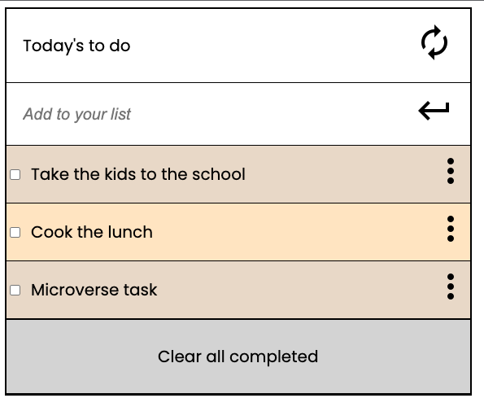

## To do list

> Webpack Implementation.

- For this project I:
- Setup webpack
- Created a to do list skeleton
- Display dinamically 3 task from an static array of objects.

## Built With

- HTML, CSS & JS
- Visual Studio Code
- Webpack
- Linters

## Set up locally

- Open your terminal and run the following command: git clone https://github.com/AlexRS90/to-do-list.git
- Run the command "npm install"
- Run the command "npm run build"
- Run the command "npm run start"

Once you completed this steps you should see the app running at: http://localhost:8080/ in your browser.

## Author 👤

👤 **Alejandro Ramos**

- GitHub: [@githubhandle](https://github.com/AlexRS90)
- Twitter: [@twitterhandle](https://twitter.com/AlejandroRBenji)
- LinkedIn: [LinkedIn](https://www.linkedin.com/in/alejandro-ramos-santos-9b0b52135/)

## 🤝 Contributing

Contributions, issues, and feature requests are welcome!

Feel free to check the [issues page](https://github.com/AlexRS90/to-do-list/issues)

## Show your support

Give a ⭐️ if you like this project!

## Acknowledgments

- Hat tip to anyone whose code was used
- Inspiration
- etc

## 📝 License

This project is [MIT](./MIT.md) licensed.